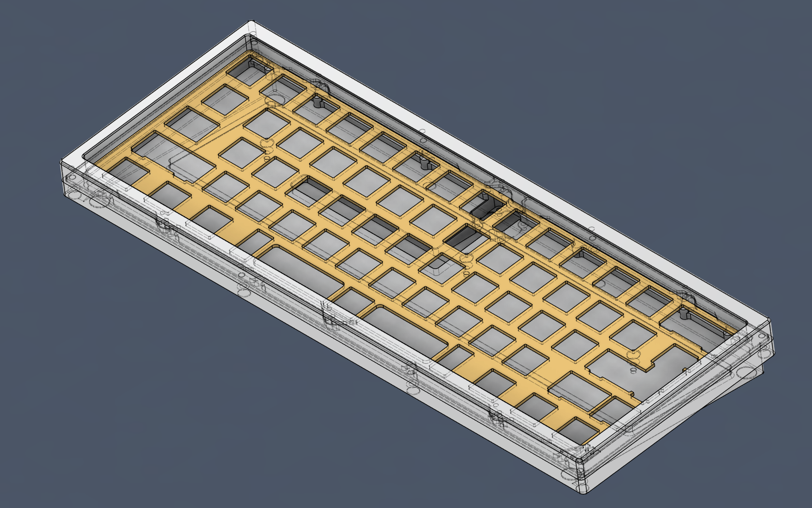
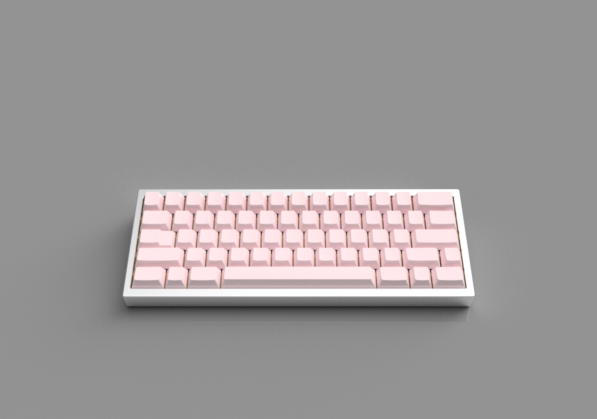
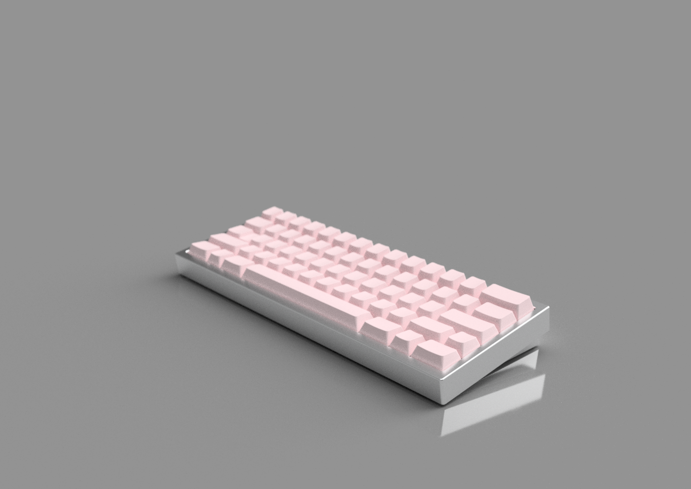
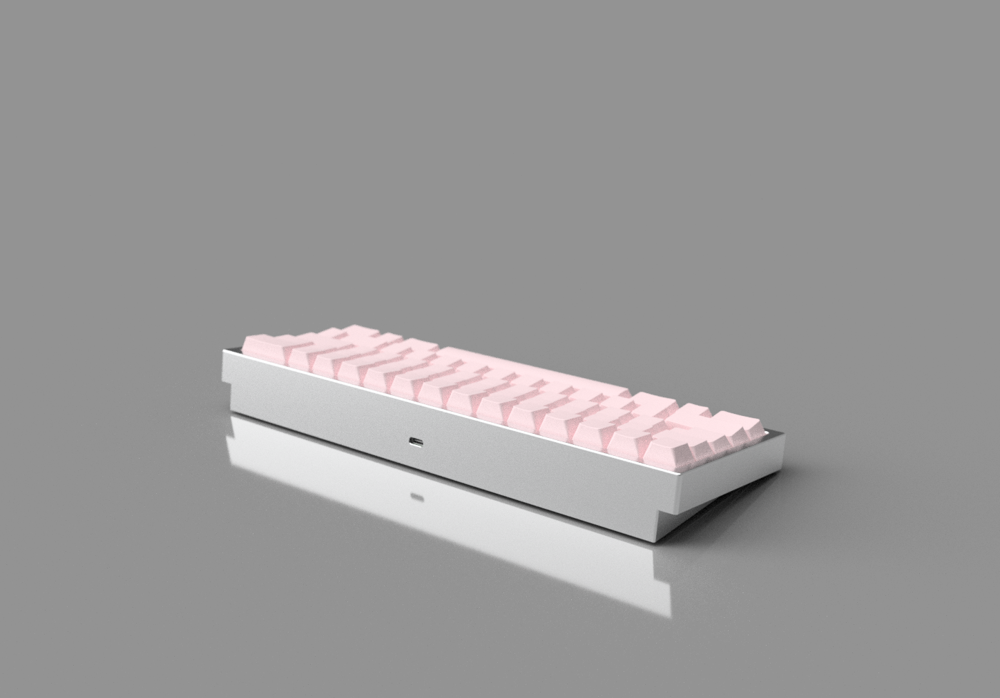

# KlasseS60

Case and plate files for **Klasse S60**, a 60% keyboard inspired by early kustoms with a dual mounting system for top mount and O-ring gasket mount. Klasse S60 is designed around the Typ 60 PCB, C3 unified daughterboard, and will work with the Typ 60 plate.

## Files
### Keyboard
- [Top](https://github.com/14x71/KlasseS60/blob/main/STEP/Klasse_S60_Top.step)
- [Bottom](https://github.com/14x71/KlasseS60/blob/main/STEP/Klasse_S60_Bot.step)
- [Weight](https://github.com/14x71/KlasseS60/blob/main/STEP/Klasse_S60_Weight.step)

### Plate
- [Top mount 7u](https://github.com/14x71/KlasseS60/blob/main/DXF/S60_Plate_Top_7u)
- [Hybrid Universal](https://github.com/14x71/KlasseS60/blob/main/DXF/S60_Plate_Hybrid_Universal)

### PCB
Designed around [Typ 60 / Typ 60SL PCB](https://www.axiomstudios.shop/collections/typ-series/products/typ-60-extras), and the C3 unified daughterboard. Any 60% PCB with the appropriate cutouts and correct JST header placement will work.

### Hardware
- Case screws: M2.5 x 10mm * 8
- Plate screws: M2 x 6mm * 6
- Daughterboard screws: M2 x 4mm * 4
- Weight screws: M2.5 x 5mm * 3 (Countersunk)
- Rubber feet: Circular 8mm (Max) / 3M SJ5302

Please note that the threaded holes are not modeled in the files.

### Renders

### Licenses
The files in the repository are licensed under the Attribution-NonCommercial 4.0 International, refer to [LICENSE](https://github.com/14x71/KlasseS60/blob/main/LICENSE.md) for further details.
